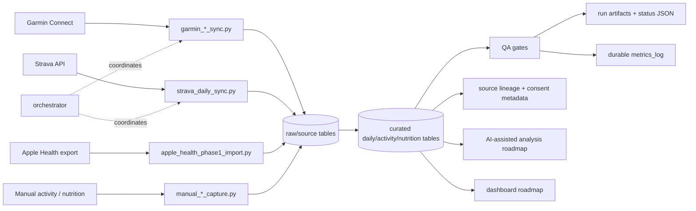

# Personal Health Data Platform

This repository documents a personal health-data platform for owning, normalizing, quality-checking, and analyzing workout, activity, wellness, and nutrition data across Garmin, Strava, Apple Health exports, manual activity capture, and manual nutrition capture.

The project began as a way to take control of my own health and workout data and make it available to an AI agent for longitudinal analysis. Instead of relying only on fragmented vendor dashboards, this system creates a private Postgres-backed data layer with raw ingestion, curated tables, QA checks, recovery/backfill workflows, source lineage, and consent metadata.

The system is still under active development. It currently provides core ingestion and reliability controls for a real personal pipeline, while the roadmap expands toward dashboards, trend analysis, agent-assisted summaries, and operational workflows for monitoring data freshness and source failures.

**Repository short description:** A private, Postgres-backed personal health-data platform that consolidates fragmented workout, wellness, activity, and nutrition data into an AI-accessible analytics layer.

## Why This Matters

Health, workout, activity, recovery, and nutrition data is usually scattered across vendor apps and exports. Each source has different schemas, missing-data behavior, API limits, export formats, and reliability issues.

This project turns fragmented vendor data into a private, queryable source of truth with:

- personal data ownership instead of app-by-app lock-in
- raw + curated storage so original source records are preserved while normalized tables support analysis
- QA gates based on user-facing data completeness, not just whether a sync job exited successfully
- source lineage and consent metadata for responsible data handling
- recovery/backfill workflows when vendors return empty payloads, rate-limit, or miss historical records
- a foundation for longitudinal health analytics and AI-assisted analysis

The goal is not to provide medical advice. The goal is to make personal health and fitness data reliable, inspectable, and useful for non-clinical trend analysis.

## Current Operating Status

This is a real personal data pipeline feeding a private Postgres-backed data layer. The public repository is sanitized and portfolio-safe; it documents the architecture, reliability patterns, and development path without exposing private personal health data.

Current capabilities include:

- Garmin daily wellness, activity, activity-detail, body-composition, lifting, and readiness ingestion paths
- Strava activity ingestion and route sync helpers
- Apple Health export import fallback
- manual activity capture for workouts missing from watch/API syncs
- manual nutrition capture for chat/photo-estimated meals
- raw and curated health schemas
- QA checks for freshness, source-empty conditions, and critical daily metric completeness
- rate-limit handling and Garmin circuit-breaker behavior
- recovery/backfill workflows for missing or failed dates
- durable run artifacts and metrics logging
- source lineage and consent metadata
- local-first credential handling with no committed secrets

Scope boundaries:

- This repository is not a medical device, diagnostic tool, or clinical recommendation engine.
- It does not claim full parity with every vendor endpoint or every possible health datapoint.
- AI assistance is planned and partially supported through structured data access, QA artifacts, and summaries; it is not framed as a clinical advisor.

## Data Sources

Supported or modeled sources:

- **Garmin Connect** — daily wellness, activities, activity details, body composition, lifting, readiness, and related enrichment tables.
- **Strava** — activity ingestion, route handling, and raw-to-curated activity sync helpers.
- **Apple Health exports** — zip/import fallback path for data that may not be available through cloud APIs.
- **Manual activity capture** — structured fallback for workouts recorded in screenshots, chats, or notes.
- **Manual nutrition capture** — structured logging for meals and estimates without depending on rigid third-party food databases.

Garmin access uses community libraries against Garmin Connect endpoints rather than a public official Garmin API product. The project therefore treats auth variability, source-empty responses, and rate limits as normal operating conditions to handle conservatively.

## Data Architecture

The system uses a private Postgres-backed data layer with separate raw, curated, QA, metrics, lineage, and manual-capture concepts.



Key components:

- Orchestrator: `scripts/garmin_primary_ingest_orchestrator.py`
- Source workers: `scripts/garmin_*_sync.py`, `scripts/strava_daily_sync.py`, `scripts/apple_health_phase1_import.py`
- Manual capture workers: `scripts/manual_activity_capture.py`, `scripts/manual_nutrition_capture.py`
- QA/status: `scripts/health_qa_daily.py`, `scripts/health_pipeline_status.py`
- Metrics: `scripts/health_metrics.py`, `health.metrics_log`
- Schema/migrations: `scripts/db_cli.py`, `sql/*.sql`
- Consent/source lineage: `CONSENT.md`, `health.data_lineage`
- Quarantine pattern: `sql/health_data_quarantine.sql`

## Reliability and QA

The pipeline is designed around operational reliability, not just successful API calls.

Reliability patterns include:

- source-empty detection when a vendor returns placeholder or missing data
- critical daily completeness checks for user-facing Garmin wellness metrics
- QA artifacts such as `output/health_qa_daily_latest.json`
- structured orchestrator run artifacts such as `output/garmin_primary_ingest_orchestrator_last_run.json`
- Garmin 429/rate-limit circuit breaker and cooldown lockout persistence
- QA execution even when a source sync is skipped due to lockout
- explicit `--mode backfill --since YYYY-MM-DD --until YYYY-MM-DD` recovery runs
- merge-safe writes, per-date job tracking, and conflict logging
- durable operational metrics in `health.metrics_log`
- integration checks against an isolated Postgres test database

Important QA principle: a sync is not considered healthy just because a job ran. It is healthy only when expected user-facing values are populated and QA checks pass.

## AI-Assisted Analysis Roadmap

The data layer is being shaped so an AI agent can work against reliable, lineage-aware health data rather than scattered app screenshots or raw exports.

Planned and emerging workflows include:

- daily/weekly summaries grounded in curated tables and QA status
- longitudinal health analytics across activity, wellness, recovery, and nutrition trends
- workout and recovery analysis using Garmin, Strava, Apple Health, and manual records together
- anomaly/freshness monitoring with source-aware explanations
- backfill/recovery recommendations when data completeness fails
- dashboard views that expose the same trusted metrics an AI agent would summarize
- agent-accessible run artifacts so summaries distinguish “no workout,” “source empty,” “rate limited,” and “data missing” correctly

This roadmap is intentionally AI-adjacent without making clinical or diagnostic claims.

## Quickstart

For contributors, see `CONTRIBUTING.md` for the 15-minute setup path, branch/PR expectations, and issue templates.

For a friend/collaborator setting this up against their own Garmin or Strava account, start with `docs/FIRST_RUN.md`.

1. Create/update the repo-local virtualenv:
   - `make venv`
2. Copy `.env.example` to `.env` in repo root and set credentials.
3. Run local checks:
   - `make test`
4. Run isolated Postgres integration checks:
   - `make test-integration`
   - `make test-db-down` when finished
5. Bootstrap + migrate DB schema:
   - `.venv/bin/python scripts/db_cli.py bootstrap`
   - `.venv/bin/python scripts/db_cli.py migrate`
6. Validate DB readiness:
   - `.venv/bin/python scripts/db_cli.py validate`
7. Run one-shot ingest:
   - `scripts/health_primary_sync_safe.sh`
8. Inspect artifacts:
   - `output/garmin_primary_ingest_orchestrator_last_run.json`
   - `output/health_qa_daily_latest.json`

## Scheduling

After the first successful manual run, see `deploy/` for daily scheduling examples:

- `deploy/health-sync.service` + `deploy/health-sync.timer` for the recommended systemd path
- `deploy/crontab.example` for the simpler cron fallback
- `deploy/logrotate.conf.example` for repo-local log rotation

Daily sync is sufficient for normal use. Run `scripts/health_primary_sync_safe.sh` manually for one-off post-workout pulls.

## Responsible Data Practices

- No credentials in source code.
- Use env vars + `.env` only.
- Do not commit `.env` or local database dumps.
- Preserve source lineage where practical.
- Keep consent metadata explicit for each source.
- Avoid committing private health exports, raw personal payloads, screenshots, or tokens.

## Manual Activity Capture

When a workout is not recorded by watch sync, capture it manually:

```bash
python3 scripts/manual_activity_capture.py \
  --start "2026-04-08T15:00:00-04:00" \
  --activity-type treadmill_manual \
  --duration-min 32 \
  --distance-mi 2.1 \
  --calories 280 \
  --notes "Captured from screenshot"
```

This stores to `health.activities_manual_raw` and optionally auto-links to Garmin/Strava rows to avoid double-counting.

## Manual Nutrition Capture

Log meals without relying on rigid app databases:

```bash
python3 scripts/manual_nutrition_capture.py \
  --when "2026-04-08T18:30:00-04:00" \
  --meal-name "Beef bowl" \
  --meal-type dinner \
  --items-json '[{"name":"ground beef","qty":10,"unit":"oz","calories":700,"protein_g":55,"fat_g":50},{"name":"rice","qty":1.5,"unit":"cup","calories":300,"carbs_g":66,"protein_g":6}]' \
  --notes "Captured from photo + estimate"
```

Writes to:

- `health.nutrition_manual_raw`
- `health.nutrition_manual_items`
- `health.nutrition_daily_totals` view
- `health.health_daily_combined` view

## Apple Health Export Fallback

Import a zipped Apple Health export when Garmin/cloud endpoints are incomplete:

```bash
python3 scripts/apple_health_phase1_import.py --zip data/apple_health/export_iphone_healthdata.zip
```

Optional Gmail fetch helper, when `gog` is configured locally:

```bash
scripts/apple_health_fetch_and_import.sh
```

## Documentation

- `docs/ARCHITECTURE.md`
- `docs/ROADMAP.md`
- `docs/DATA_COVERAGE_MATRIX.md`
- `docs/KNOWN_LIMITATIONS.md`
- `docs/SUPPORT_SCOPE.md`
- `docs/FIRST_RUN.md`
- `docs/HEALTH_INGEST_RUNBOOK.md`
- `CONSENT.md`
- `CHANGELOG.md`

## Repository Rename Recommendation

Recommended future repository name:

```text
personal-health-data-platform
```

Reason: it reflects the current positioning as a personal health-data platform rather than a narrow ingestion utility.

Other reasonable options:

- `health-data-platform`
- `ai-ready-health-data-pipeline`
- `personal-health-analytics-pipeline`
- `health-data-ops-platform`

## Before / After Positioning

Before:

> A health-app data ingestion utility focused on pulling records from Garmin, Strava, Apple Health, and manual capture sources.

After:

> A private, Postgres-backed personal health-data platform that consolidates fragmented workout, wellness, activity, and nutrition data into an AI-accessible analytics layer, with a roadmap toward dashboards, trend analysis, agent-assisted summaries, and operational monitoring.
