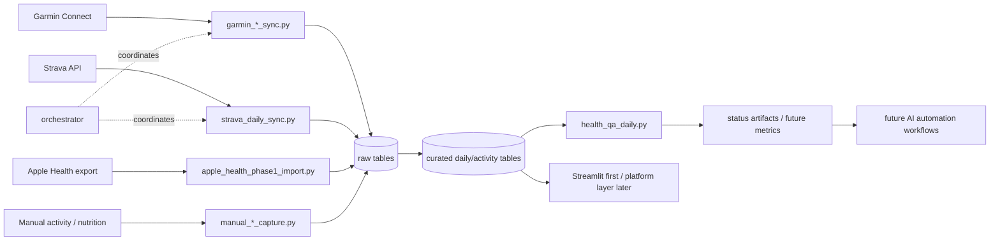

# Health Apps Data Pull

AI-assisted data ops prototype for reliable personal-data automation: Garmin, Strava, Apple Health export, manual activity, and manual nutrition ingestion into a private PostgreSQL store.

The project is intentionally a work in progress. The aim is to demonstrate how to build an implementable automation pipeline around messy third-party data sources: ingest raw data, normalize it, detect quality failures, recover from outages, and expose the result through dashboards and AI-assisted operational workflows.

## Goals
- Private data ownership
- Resilient ingestion with rate-limit handling
- Raw + curated storage model
- QA gates based on user-facing data completeness
- Recovery/backfill workflows for source outages
- Open-source deployability (no hardcoded local secrets)
- Visualization path that starts streamlined, then iterates toward a fuller data-platform construction
- Future AI automation layer for status, remediation, and onboarding-style demos

## Scope statement
This project currently provides **core Garmin + Strava ingestion**, Apple Health export import, manual activity/nutrition fallbacks, and reliability controls that were added incrementally for a real personal pipeline.

It should not yet be represented as a finished health app or complete "all datapoints" parity for every source endpoint. It is best understood as a practical automation/data-engineering prototype that is being hardened into a cleaner collaborative project.

See:
- `docs/ROADMAP.md`
- `docs/DATA_COVERAGE_MATRIX.md`
- `docs/KNOWN_LIMITATIONS.md`
- `docs/SUPPORT_SCOPE.md`

## Quickstart
1. Create/update the repo-local virtualenv:
   - `make venv`
2. Copy `.env.example` to `.env` in repo root and set credentials.
3. Run local checks:
   - `make test`
4. Run isolated Postgres integration checks:
   - `make test-integration`
   - `make test-db-down` when finished
5. Bootstrap + migrate DB schema:
   - `.venv/bin/python scripts/db_cli.py bootstrap`
   - `.venv/bin/python scripts/db_cli.py migrate`
6. Validate DB readiness:
   - `.venv/bin/python scripts/db_cli.py validate`
7. Run one-shot ingest:
   - `scripts/health_primary_sync_safe.sh`
8. Inspect artifacts:
   - `output/garmin_primary_ingest_orchestrator_last_run.json`
   - `output/health_qa_daily_latest.json`

## Architecture (high level)



- Orchestrator: `scripts/garmin_primary_ingest_orchestrator.py`
- Source workers: `scripts/garmin_*_sync.py`, `scripts/strava_daily_sync.py`, `scripts/apple_health_phase1_import.py`
- Manual capture workers: `scripts/manual_activity_capture.py`, `scripts/manual_nutrition_capture.py`
- QA/status: `scripts/health_qa_daily.py`, `scripts/health_pipeline_status.py`
- SQL schema: `sql/*.sql`

## Operational behavior
- Circuit breaker on Garmin SSO 429
- Cooldown lockout persistence
- Structured run artifact output
- QA still runs when Garmin is lockout-skipped
- Garmin daily wellness supports explicit `--mode backfill --since YYYY-MM-DD --until YYYY-MM-DD` recovery runs with merge-safe writes, per-date job tracking, and conflict logging.

## Security
- No credentials in source code.
- Use env vars + `.env` only.
- Do not commit `.env`.

## Community note
Garmin access uses community libraries against Garmin Connect endpoints (not a public official Garmin API product). Expect occasional auth/rate-limit variability and use conservative scheduling.

## Security and support docs
- `docs/SECURITY.md`
- `docs/SUPPORT_SCOPE.md`
- `docs/KNOWN_LIMITATIONS.md`

## Manual activity capture (screenshot/chat fallback)
When a workout is not recorded by watch sync, capture it manually:

```bash
python3 scripts/manual_activity_capture.py \
  --start "2026-04-08T15:00:00-04:00" \
  --activity-type treadmill_manual \
  --duration-min 32 \
  --distance-mi 2.1 \
  --calories 280 \
  --notes "Captured from screenshot"
```

This stores to `health.activities_manual_raw` and optionally auto-links to Garmin/Strava rows to avoid double-counting.

## Manual nutrition capture (chat/photo estimates)
Log meals without relying on rigid app databases:

```bash
python3 scripts/manual_nutrition_capture.py \
  --when "2026-04-08T18:30:00-04:00" \
  --meal-name "Beef bowl" \
  --meal-type dinner \
  --items-json '[{"name":"ground beef","qty":10,"unit":"oz","calories":700,"protein_g":55,"fat_g":50},{"name":"rice","qty":1.5,"unit":"cup","calories":300,"carbs_g":66,"protein_g":6}]' \
  --notes "Captured from photo + estimate"
```

Writes to:
- `health.nutrition_manual_raw`
- `health.nutrition_manual_items`
- `health.nutrition_daily_totals` (view)
- `health.health_daily_combined` (view)

## Apple Health export fallback
Import a zipped Apple Health export when Garmin/cloud endpoints are incomplete:

```bash
python3 scripts/apple_health_phase1_import.py --zip data/apple_health/export_iphone_healthdata.zip
```

Optional Gmail fetch helper, when `gog` is configured locally:

```bash
scripts/apple_health_fetch_and_import.sh
```

## Roadmap and collaboration
- `docs/ROADMAP.md` — current hardening roadmap and planned visualization/AI automation layer
- `docs/reports/health-sync-progress-2026-04-08.md` — latest progress report

Planned visualization direction:
- Start with a streamlined dashboard layer, likely Streamlit, to move quickly and learn from real usage.
- Iterate toward a more platform-style construction once the useful views and workflows are clear.
- Use that progression intentionally to compare fast prototype dashboards with more durable product/data-platform patterns.

Areas where feedback would be especially useful:
- Dashboard views that would make the system easiest to understand quickly
- AI-assisted workflows that would best demonstrate client-facing automation/POC skills
- Schema boundaries between raw, curated, manual fallback, QA, and future metrics
- How to make the project reusable beyond one personal health-data use case
